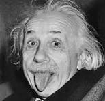

title: Wise Fools
date: 2025-08-12
author: emisshula
category: education
tags: ambition, persitence
slug: fools

# Holy and Wise: The mythology and contributions of the fool in mathematics and physics

On August 8th, the NY Times published a long [essay](https://www.nytimes.com/2025/08/08/technology/ai-chatbots-delusions-chatgpt.html) about Allan Brooks
who fell under a dellusion that he had "had discovered a novel
mathematical formula, one that could take down the internet and power
inventions like a force-field vest and a levitation beam." His story
of struggle and low self-esteem and encouragement to delusion by
openAI's chatGPT really touched me as a student of mathematics. I
sincerely hope that people will not draw the wrong the conclusions
from it. I currently teach Python programming to formerly incarcerated students
and in the past have taught remedial math to college students.

Here are five articles from popular sources that consider the possibility
that human thought or creativity will cease because of AI:

1.  **New York Times – "A.I. May Not Take Your Job, but It Could Change It"** – Discusses concerns about AI reducing the scope for human creativity and independent thought.
    [<https://www.nytimes.com/2023/03/20/technology/ai-chatgpt-jobs.html>](<https://www.nytimes.com/2023/03/20/technology/ai-chatgpt-jobs.html>)

2.  **The Atlantic – "The End of Human Art? An AI Wins an Art Competition"** – Raises questions about whether AI creativity displaces or erodes human artistic thinking.
    [<https://www.theatlantic.com/technology/archive/2022/09/ai-generated-artwork-wins-state-fair-competition/671413/>](<https://www.theatlantic.com/technology/archive/2022/09/ai-generated-artwork-wins-state-fair-competition/671413/>)

3.  **The Guardian – "Will AI Spell the End of Creativity as We Know It?"** – Explores whether AI could fundamentally replace human creative processes.
    [<https://www.theguardian.com/technology/2023/apr/09/will-ai-spell-the-end-of-creativity-as-we-know-it>](<https://www.theguardian.com/technology/2023/apr/09/will-ai-spell-the-end-of-creativity-as-we-know-it>)

4.  **Washington Post – "Is ChatGPT Coming for Human Creativity?"** – Looks at fears that language models could take over the act of original thought.
    [<https://www.washingtonpost.com/technology/2023/02/20/chatgpt-ai-creativity/>](<https://www.washingtonpost.com/technology/2023/02/20/chatgpt-ai-creativity/>)

5.  **New Yorker – "Will Artificial Intelligence Replace Human Writers?"** – Frames the discussion in terms of literary creativity and intellectual labor.
    [<https://www.newyorker.com/news/the-weekend-essay/will-artificial-intelligence-replace-human-writers>](<https://www.newyorker.com/news/the-weekend-essay/will-artificial-intelligence-replace-human-writers>)

Here are three which  specifically call for the end of mathematics:

1.  **"Will A.I. Kill Math?" – The New Yorker** Explores whether AI’s
    ability to generate proofs and solve problems could make
    traditional human mathematical discovery obsolete.  
    [<https://www.newyorker.com/tech/annals-of-technology/will-ai-kill-math>](<https://www.newyorker.com/tech/annals-of-technology/will-ai-kill-math>)

2.  **"The End of Math as We Know It?" – Quanta Magazine** Looks at
    AI systems that can find proofs far beyond human reach and what
    this means for the future of the field.  
    [<https://www.quantamagazine.org/the-end-of-math-as-we-know-it-20231005/>](<https://www.quantamagazine.org/the-end-of-math-as-we-know-it-20231005/>)

3.  **"A.I. May Not Kill Us, but It Will Break Our Brains" – The New
    York Times** Discusses the potential erosion of human
    problem-solving skills, including in mathematics.  
    [<https://www.nytimes.com/2023/09/29/opinion/ai-brain-effect.html>](<https://www.nytimes.com/2023/09/29/opinion/ai-brain-effect.html>)

Of course, I will argue that these fears are overblown. More
importantly this article, I hope will convince you that we all start
out as fools. I hope to give you a list of practices you can do,
wherever you are (including prison) to do to help bring yourself out
of the mud and darkness of mathematical ignorance.

Assuming nothing else, keep your research ideas in a notebook. Next,
realize that for people to take you seriously and for you to guide the
fruits of any discovery, you will have to master many areas of
mathemtics.  This will take time and great effort but it is possible.

# Becoming Numerate

 In fact, there was a time -not that long ago -when many
believed that only a small slice of humanity could ever be
literate. In the Middle Ages, and even into the 18th century, some
assumed there was a natural ceiling — maybe 20 or 30 percent of people
could ever read and write well enough to participate in intellectual
life. History proved them wrong.

With mass education, cheap books, and a belief that literacy was for
everyone, reading and writing went from elite privilege to a
near-universal skill. Not everyone arrived there at the same time.
So you did not go to an elite private school for primary school
addition and subtraction. So you learned Calculus in a detention
center. So what?

I think about that history when I think about mathematics -and about
anyone who has ever been told they aren't "a math person." Maybe you
don’t have a degree. Maybe you never finished high school or got a GED.
Maybe formal education feels like a door that closed a long time ago.
But none of that means you can't learn mathematics deeply, contribute to
the field, and be taken seriously by professional mathematicians.

You need to start with whatever tools you have -free online courses, open
textbooks, public lectures, even formal proof assistants like Lean 4 to
help check your reasoning. Over time, you can join conversations with
researchers, share your work, get feedback, improve, and build the kind
of mathematical writing that earns respect in serious venues. I know this
is a lot to take in. This article is going to give you a list of free
resources and practices to begin this journey and not stop until you
are ready to reveal your thoughts and have them seriously considered.

Maybe you will realize that you haven't broken the internet or invented a
levitation beam but you will gain a deep appreciation for those that have
done great work and one day you might be cited in someone else's great
advance.

I would argue the idea that "most people can't do math" is not a law
of nature. It is a cultural assumption -one that can be overturned
just as surely as the old ceiling on literacy. The tools now exist to make advanced
mathematics learnable by you and I will show you how to use your
access to gain materials, develope mentors and expect more of
yourself. All this, so you can refine your ideas, discover the gaps in
your reasoning without becoming so discouraged that you quit.

It is my dream that if we do that together the next generation of
mathematicians will include people who were never supposed to be there
including you and me -and we'll make discoveries we can't yet imagine.

# The tools

The first thing you need is instruction and tools. If you are in
prison or you love someone in I will give you instruction to get Kahn
Academy Lite.  For everyone else the first step should be [Kahn
Academy](https://www.khanacademy.org/).  I first used the 15 years ago when it was a bunch of
random links on a page. They will meet you wherever you are and give
you feedback. You can even learn Python on it.

1.  **OpenStax – Precalculus**
    -   Free, openly licensed PDF textbook with worked examples and
        exercise solutions (selected).
    -   [<https://openstax.org/details/books/precalculus>](<https://openstax.org/details/books/precalculus>)

2.  **CK-12 Foundation – Precalculus Concepts**
    -   Covers algebra, trigonometry, functions, and more. Includes
        examples and practice problems with solutions.
    -   [<https://www.ck12.org/book/ck-12-precalculus-concepts/>](<https://www.ck12.org/book/ck-12-precalculus-concepts/>)

3.  **College of the Redwoods – Precalculus Text**
    -   Free PDF textbook with full solutions manual available
        separately.
    -   [<https://mathrev.redwoods.edu/Precalculus/>](<https://mathrev.redwoods.edu/Precalculus/>)

4.  **OpenMathReference – Precalculus Problems with Solutions**
    -   Not a single PDF, but downloadable problem sets with worked
        solutions.
    -   [<https://openmathreference.com/precalculus.html>](<https://openmathreference.com/precalculus.html>)

5.  **Stitz-Zeager Open Source Precalculus**
    -   Very thorough, includes a full solutions manual.
    -   [<http://www.stitz-zeager.com/>](<http://www.stitz-zeager.com/>)

For Calculus, the standard text is Spivak Calculus.  You can get it used
on Ebay for $40.  The problem is it does not have worked solutions
but you can find them if you search Math Stack Exchange or GitHub.

I would start with:

[Michael Corral — Elementary Calculus (Early Transcendentals)](https://www.mecmath.net/calculus/ElementaryCalculus.pdf) Thorough
single-variable text with a decent amount of theory; free, with
answers/hints to odd problems provided by the author (easier than
Spivak but solid).

and move to:

[Keisler — Elementary Calculus: An Infinitesimal Approach](https://people.math.wisc.edu/~hkeisler/calc.html) A beautiful,
rigorous take on single-variable calculus; very Spivak-adjacent in
depth and style. Freely hosted; many chapters include answers or hints
(full teacher’s solutions aren’t generally public).

## Ancillary skills

Now if you want to be taken seriously, you need a few more skills. You
need to learn LaTeX. This will allow you to write and format you
theories, questions and homework.  The best introduction I know is the
[Not so short introduction to LaTeX](https://tobi.oetiker.ch/lshort/lshort.pdf). Write you homework up in LaTeX. It
will be painful and slow.  Your TA's will thank you.

You also need to learn Python.  Again the best introduction I know is
[Python the Hard Way](https://learnpythonthehardway.org/). There will be math problems that call for
computation.  This makes you useful in any group.  

Finally, to make sure you are not being fed a delusion by AI chatbot
you need to learn use a proof assistant. It is really just a compiler
realy that makes sure you are not kidding yourself because it will
only follow the rules of logic. I am not going to kid you, this is 10x
harder than writing proofs in LaTeX and not generally part of
undergraduate math education yet.

### Here are the resources you won't find anywhere else yet

1.  **Formalized Euclidean Geometry by Alex Kontorovitch**
    -   Here is an introduction to Euclidean Geometry by a respected (and
        kind) analytic number theorist who is also co-lead on a project
        to formalize the [Prime Number Theorem](https://x.com/AlexKontorovich/status/1753061712020828328) with Terrance Tao (the very
        Mozart of Math) named in article that inpired this piece.
        
        These are 13 lectures that happened starting July 7, 2025, for
        middle school kids in [Math Corps](https://sas.rutgers.edu/about/news/faculty/faculty-news-detail/rutgers-mathematician-connects-with-community-and-turns-scott-hall-into-summer-camp). I watched them.  I guarantee
        you will enjoy hearing about Euclid's gaps in logic and
        "hallucinations". Here are the links:
        
        1.  <https://www.youtube.com/watch?v=JAIN7FQwr_8>
        2.  <https://www.youtube.com/watch?v=4wDJfuPr-Yo>
        3.  <https://www.youtube.com/watch?v=wN4vNqoeUMM>
        4.  <https://www.youtube.com/watch?v=3F6bvkSSWOw>
        
        5.  <https://www.youtube.com/watch?v=ttOv_C1Y1Go>
        6.  <https://www.youtube.com/watch?v=Q1cvVf2_n_o>
        7.  <https://www.youtube.com/watch?v=lJ5bYWbPtC4>
        8.  <https://www.youtube.com/watch?v=96vvPooTLko>
        
        9.  <https://www.youtube.com/watch?v=5BXcxqCIQas>
        
        10. <https://www.youtube.com/watch?v=ea25ud96mQc>
        11. <https://www.youtube.com/watch?v=H-1oSCpF6ZM>
        12. <https://www.youtube.com/watch?v=H-1oSCpF6ZM>
        
        13. <https://www.youtube.com/watch?v=H-1oSCpF6ZM>

2.  There is one university where Lean 4 was taught as an integral part
    of a course on proofs, Fordham University. It was taught by Heather
    Macbeth who is now on a research sabbatical to Imperial College. I
    would not count on her returning. Here is a link to Heather
    Macbeth's: [The Mechanics of Proof](https://hrmacbeth.github.io/math2001/)

3.  At Stanford, the Computer Science Department sponsored an equally
    innovative course on the connection between formal verification and
    theorem proving. This is the link to Leni Aniva's:
    -   [CS 99: Functional Programming and Theorem Proving in Lean 4](https://perfect-math-class.leni.sh/)

I don't care what your background is. If you can write your proof
and verify it in Lean4. You are almost ready to ask for feedback.

You need at least one mentor. This is someone who has published
a math research paper in the last five years.  We do not teach
students how to judge researchers.

## How to judge a professor's research for an outsider

The **h-index** is a widely used metric for evaluating mathematics
researchers by balancing two aspects of scholarly impact: productivity
(number of papers) and influence (number of citations). A
mathematician has an h-index of **h** if they have **h** papers each cited
at least **h** times. This makes it more robust than simply counting
total citations, which can be skewed by one blockbuster paper, or
total papers, which ignores whether anyone read them. While imperfect,
it does encourage a long-term pattern of substantive contributions
rather than short bursts of activity or purely incremental work.

That said, the h-index has clear **limitations**. It favors researchers
in larger or faster-moving subfields where citation rates are higher,
and it underestimates those working in niche but foundational areas
where the audience — and thus citation count — is naturally
smaller. It also accumulates over time, which can make younger but
high-potential mathematicians look less accomplished compared to
senior figures. Moreover, it says nothing about originality, depth,
teaching impact, or the beauty of results — qualities mathematicians
themselves often value most.

Still, as a **ranking tool**, the h-index is far more defensible than
something like the **U.S. News & World Report** rankings, which often
rely on opaque “reputation scores,” outdated surveys, and structural
biases that reward wealthy institutions rather than actual scholarly
contribution. An h-index is at least grounded in measurable research
output and peer acknowledgment, even if it must be interpreted
carefully and supplemented with qualitative judgment. In that sense,
it can serve as a more honest  -if still incomplete  -starting point
for assessing the standing of a researcher in the mathematical
community.

Look at the h-index of anyone you are considering and take there
class.  Lower h-index but closer physical proximity is preferred. Go
to the office hours and TA recitations. Do the reading, ask
questions. Do the reading before class and nd come with a list of
questions.  If the questions are not answered during class bring them
to recitation and office hours. Ask your TA's and your professor about
their research. See if there are internships and research
assistantships available.  Many departments have money set aside for
undergraduate research.

Speaking of funded research, keep [Pathways to Science](https://www.pathwaystoscience.org/) on your radar
even for math, it is a listing of federally funded research
opportunities for high school students and beyond.

# How could that be, I didn’t even graduate high school?

The tradition of the *wise fool* goes as far tack as the ancient
Greeks. Among many other inventions Greek Poets invented the tragic
hubristic hero from Greek drama — someone whose virtues, taken too
far, become their undoing — is a clear ancestor to Quixote’s mixture
of courage and folly. My cultural background is decidely more mid/basic
so I will link to a version of the Broadway standard:

[To Dream, The Impossible Dream](https://www.youtube.com/watch?v=oo7VlD66ISM)

And from my own ethnic tradition Tevye the Dairyman (Sholem Aleichem,
1894–1914 stories) grew out of Yiddish storytelling traditions that
themselves blended Jewish folklore, rabbinic parables, and the wry,
self-deprecating humor of the shtetl. The "poor but dignified man with
too many daughters" trope has biblical echoes (think of Job's trials
mixed with the wry fatalism of Ecclesiastes) and you also see traces of the
European peasant storyteller, whose commentary on life balances
resignation with wit. Sholem Aleichem elevated this into a character
who, like Don Quixote, insists on interpreting his world through a
personal moral framework, even when history and economics make him
look foolish. I remember my father, a laborer in the garment
industry also bargaining with G-d for a better economic turn. I often
cry thinking of him when I watch Zero Mostel sing:

[If I were a rich man](https://www.youtube.com/watch?v=nbJEpcteKg4)

In the article Allen Brooks asks in the context of how he could have or
could possibly make a contribution

> How could that be, I didn’t even graduate high school?

The villain of the story ChatGpt retorts with a laundry list of wise
fools and outsiders who made contributions including Michael Faraday,
Srinvasa Ramanujan, Leonardo Da Vinci and R. Buckminster Fuller. Well
I want to offer an even longer list that I cherish to encourage me
when I fall into a depression about my own intellectual inadequacies
and career errors only tempered by the warning that you can make a
contribution, you just have much more work to do before you call the
NSA or the Canadian Centre for Cyber Security or any research
mathematician.

# The list and the patterns

## Niels Henrik Abel

Niels Henrik Abel was a mathematician who lived from 1802 to 1829. He
is notable for proving quintic unsolvability and advancing elliptic
function theory. Despite being born poor in rural Norway and facing
financial hardship, Abel's genius was recognized through his
work. Unfortunately, he died before receiving the recognition he
deserved. For more information, see Arild Stubhaug's book "Niels
Henrik Abel and His Times" (Springer, 2013).

## Srinivasa Ramanujan

Srinivasa Ramanujan was a mathematician who lived from 1887
to 1920. He made significant contributions to number theory, modular
forms, and infinite series. Despite being self-taught in India and
lacking a formal degree, Ramanujan relied on G.H. Hardy's mentorship
and went on to make groundbreaking contributions. For more
information, see Robert Kanigel's book "The Man Who Knew Infinity"
(1991).

## Michael Faraday

Michael Faraday was a scientist who lived from 1791 to 1867. He is
notable for his work on electromagnetic induction and
diamagnetism. Faraday was a bookbinder's apprentice with minimal
formal schooling, but he learned through lectures and self-study. For
more information, see James Hamilton's book "A Life of Discovery:
Michael Faraday, Giant of the Scientific Revolution" (2004).

## Oliver Heaviside

Oliver Heaviside was a mathematician and physicist who lived from 1850
to 1925. He is notable for developing operational calculus and
reformulating Maxwell's equations. Heaviside left school at 16 and was
self-taught, working in near isolation. For more information, see
Basil Mahon's book "The Forgotten Genius of Oliver Heaviside" (2009).

## Mary Somerville

Mary Somerville was a mathematician and astronomer who lived from 1780
to 1872. She is notable for popularizing advanced math and
astronomy. Somerville was self-taught in algebra and calculus, and she
had no formal degree. She was also a key translator of Laplace's
work. For more information, see Kathryn Neeley's book "Mary
Somerville: Science, Illumination, and the Female Mind" (2001).

## Katherine Johnson

Katherine Johnson was a mathematician who lived from 1918 to 2020. She
worked at NASA and made key contributions to orbital mechanics,
including calculations for the Mercury and Apollo missions. Johnson
faced racial and gender barriers, but she worked her way from a
segregated school to become a NASA mathematician. For more
information, see Margot Lee Shetterly's book "Hidden Figures" (2016).

## Louis de Broglie

Louis de Broglie was a physicist who lived from 1892 to 1987. He is
notable for his work on wave-particle duality of electrons. De Broglie
began in history, but he shifted to physics with Einstein's
endorsement. For more information, see Olivier Darrigol's book "From
c-Numbers to q-Numbers" (1992).

## Freeman Dyson

Freeman Dyson was a physicist who lived from 1923 to 2020. He is
notable for reformulating QED and developing visionary space
engineering concepts. Dyson did not have a PhD, but he transitioned
from RAF operations work to major theoretical contributions. For more
information, see his book "Disturbing the Universe" (1979).

## Mary Cartwright

Mary Cartwright was a mathematician who lived from 1900 to 1998. She
is notable for her work on nonlinear differential equations and early
chaos theory in radar systems. Cartwright overcame gender and
institutional barriers, becoming the first woman to earn an Oxford
D.Phil in math. For more information, see D. Strick's article "Mary
Lucy Cartwright, 17 December 1900 – 3 April 1998" in Biographical
Memoirs of Fellows of the Royal Society (2000).

## Georg Cantor

Georg Cantor was a mathematician who lived from 1845 to 1918. He is
notable for developing set theory and transfinite numbers. Cantor
faced intense opposition, and his early work was dismissed as
metaphysical. For more information, see Joseph W. Dauben's book "Georg
Cantor: His Mathematics and Philosophy of the Infinite" (1979).

## Grigori Perelman

Grigori Perelman is a mathematician born in 1966. He is notable for
solving the Poincaré conjecture. Perelman declined awards and withdrew
from academia, working in isolation. For more information, see Sylvia
Nasar and David Gruber's article "Manifold Destiny" in The New Yorker
(2006).

## Yitang Zhang

Yitang Zhang is a mathematician born in 1955. He is notable for his
work on bounded gaps between primes. Zhang spent years in obscurity
teaching at a small college before making a groundbreaking result. For
more information, see Alec Wilkinson's article "The Pursuit of Beauty"
in The New Yorker (2015).

## Stephen Wolfram

Stephen Wolfram is a mathematician and computer scientist born
in 1959. He is notable for developing cellular automata and creating
Mathematica. Wolfram earned his PhD at Caltech at age 20 and later
left academia to pursue independent research. For more information,
see his book "A New Kind of Science" (2002).

## Emmy Noether

Emmy Noether was a mathematician who lived from 1882 to 1935. She is
notable for developing Noether's theorem and abstract algebra. Noether
was barred from formal positions due to her gender and lectured under
male colleagues' names. For more information, see Auguste Dick's book
"Emmy Noether: 1882–1935".

## Lise Meitner

Lise Meitner was a physicist who lived from 1878 to 1968. She is
notable for her co-discovery of nuclear fission. Meitner fled Nazi
Germany and was excluded from Nobel recognition awarded to Otto
Hahn. For more information, see Ruth Lewin Sime's book "Lise Meitner:
A Life in Physics".

## Leo Szilard

Leo Szilard was a physicist who lived from 1898 to 1964. He is notable
for conceiving the nuclear chain reaction and working on the Manhattan
Project. Szilard trained in engineering and moved between disciplines,
becoming a key political activist in science policy. For more
information, see William Lanouette's book "Genius in the Shadows"
(1992).

## Robert G. Rudnitsky

Robert G. Rudnitsky is a physicist who has worked at NIST and advised
at the U.S. Dept. of State. He transitioned from Political Science to
physics, taking a cross-disciplinary path. For more information, see
public bios and interviews.

## Adam C. Firestone

Adam C. Firestone is a lawyer, CEO of an internet security company,
and holder of multiple patents. In Scrappy but Hapless (2025), he
blends history, wit, and startup experience to draw lessons on
leadership under pressure, from battlefields to boardrooms.

This doesn't scratch the surface or include all the people I 
know from the English, Comparitive Literature and even Theater
department I know from the CUNY graduate Center in AI centric 
secuurity.

# The patterns you should observe

1.  **Self-teaching + small network access** — Almost all eventually
    found a mentor or intellectual circle (e.g., Faraday with Humphry
    Davy, Ramanujan with Hardy).
2.  **Initial outsider status** — Many were not taken seriously at
    first (Heaviside was often dismissed as a crank; Ramanujan's early
    notebooks baffled reviewers).
3.  **Persistence** — Most worked for years in obscurity before
    recognition.
4.  **Entry point** — Public lectures, correspondence, or publishing in
    non-elite venues often opened the door.

# The conclusion you should draw

1.  If you want to be taken seriously take math seriously. Learn the
    tools and don't skip steps. Read the books, do the problems, learn
    LaTeX, learn Python and verify your work with Lean4 or some other
    proof assistant.

2.  Find a mentor, many outsiders were able to find a mentor who
    championed their cause. Math and Physics are human endeavors.
    People who love the problems rather than the prizes or fame
    attract. Don't waste your time with an miserable person. No
    one is smart enough to tolerate abuse.

3.  You thought you were right and publicly embarassed yourself. Be
    upset. Cry. Put down the vape pen. Try again. Learn to do better
    and never give up.

4.  I am not sure where the phrase "What is a winner? Just another
    loser who got up one more time". It has been attributed George
    M. Moore Jr. and Vince Lombardi. A Japanese proverb, "Fall seven
    times and stand up eight" predates it by several centuries. I
    don't care, the quote speaks to me and I will keep standing up
    and I hope you do too.
    
    1.  My next post will be on the construction of the real numbers via
        Cauchy completion of the rationals and the Carathéodory extension
        theorem for measures on a $\sigma$-algebra share a deep analogy,
        which can be elegantly formalized using category theory's
        universal properties and adjoint functors.
    
## Epilogue: A version of the Hannukah song for all of us math outsiders
    
 Adam Sandler struck a chord for many Jews isolated by distance from 
 large communities when he sang about being the only kid without a 
 Christmas tree.  Here is a link to the original:

-   <https://www.youtube.com/watch?v=KX5Z-HpHH9g>

What follows is my poetic response, sung to the
tune of Adam sandler's channukah song:

When you're the only kid in town without a degree to show,  
Here's a list of folks who proved you don't need school to glow.  
Niels Abel, broke but brilliant, cracked quintics' stubborn code,  
Ramanujan, self-taught genius, till Hardy paved the road.  
Faraday, from bookbinders' shop, made electric dreams ignite,  
Mary Somerville's starry pen taught the cosmos to take flight.  
Katherine Johnson's math soared high, sent Apollo to the moon,  
With sharp minds and helping hands, they all learned to play the tune.  

Louis de Broglie waved at particles, sparked a quantum blaze,  
Einstein's faith lit up his path through early doubters' haze.  
Freeman Dyson skipped the PhD, lit QED's bright phase,  
Found Oppenheimer's open door to guide his early days.  
Mary Cartwright swapped her classics for math's chaotic dance,  
Radar's pulse, her theory's spark, gave chaos a new chance.  
Cantor's infinite sets shook minds, made scholars lose their cool,  
Perelman solved Poincaré's riddle, spurning fame's old school.  

Yitang Zhang, with prime gaps bound, rewrote the math we know,  
Help from friends and open ears helped his long-shot theorem grow.  
Emmy Noether's algebra broke barriers none could see,  
Hilbert cleared the gate for her to shape physics' destiny.  
Lise Meitner split the atom, though Nobel passed her by,  
Her fission dreams lit up the world beneath a war-torn sky.  
Wolfram left his doctorate for cellular streams to chase,  
Szilard's chain reaction sparked a world we couldn't face.  
Rudnitsky's physics flair turned NIST into a name,  
From poli-sci to science halls, he learned to play the game.  

So when they say, "No PhD, no shot," don't buy their test,  
But if that's your dream, go chase it – and find a mentor who's the best.  
Like Hardy backed Ramanujan, or Hilbert backed Noether's hand,  
Like Einstein stood by de Broglie when few could understand.  
From number games to cosmic rays, from lab bench to the stars,  
Start with grit, a spark of you, and change what's ours.  
No degree can block your path, no gate can stop your view,  
With heart, a guide, and hustle – let the world catch up to you!  
