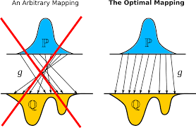

title: Research Plan
date: 2025-05-27
author: emisshula
category: Probability
tags: ambition, 
slug: game-plan

# Roadmap to Become a Machine Learning Researcher Focused on Embedded Optimal Transport

## 🧠 Phase 1: Mathematical and Theoretical Foundations

**Goal:** Build deep fluency in the theory that underpins optimal transport, geometric learning, and high-dimensional data analysis.

### Core Topics

* **Measure theory & probability**

  * “Probability with Martingales” (Williams)
  * “High-Dimensional Probability” (Vershynin)
* **Linear algebra & matrix analysis**
* **Convex optimization**

  * Boyd & Vandenberghe
* **Differential geometry & manifolds**

  * “Manifold Learning” notes (Bronstein, Coifman)
* **Optimal transport theory**

  * Villani's books: *Topics in Optimal Transport*, *Optimal Transport: Old and New*
  * Peyré & Cuturi (2019) *Computational Optimal Transport*

### Deliverables

* Annotated summaries of 3 key OT theorems (e.g. Kantorovich duality)
* Personal reference cheatsheet of duality and convex geometry principles

---

## 🔧 Phase 2: Computational Tools for Modern ML

**Goal:** Build and automate pipelines for OT-based machine learning workflows.

### Core Tooling

* **Python Ecosystem**

  * NumPy, pandas, matplotlib, scikit-learn
  * PyTorch (+ Lightning), JAX
* **Optimal Transport Libraries**

  * POT (Python Optimal Transport)
  * GeomLoss (for regularized losses on embedded manifolds)
  * OTT-JAX (scalable OT in JAX)

### Engineering Stack

* Git & GitHub workflows
* Docker & FastAPI for model serving
* MLflow or Weights & Biases for experiment tracking

### Deliverables

* Containerized OT pipeline on toy data
* Comparative benchmark of Sinkhorn vs. exact OT on CIFAR embeddings

---

## 📊 Phase 3: Embedded OT & Manifold-Based Learning

**Goal:** Specialize in methods combining geometry, dimensionality reduction, and transport.

### Topics & Papers to Reproduce

* **Wasserstein PCA**

  * \[Bigot et al., 2017] Wasserstein PCA of probability measures
* **OT on Manifolds**

  * \[Seguy et al., 2018] Large-scale OT using GANs
  * \[Vayer et al., 2020] Fused Gromov-Wasserstein OT
* **Subspace-Embedded Transport**

  * \[Courty et al., 2016] OT for domain adaptation
  * \[Bunne et al., 2022] Proximal Sinkhorn
* **JAX-based experiments**

  * Implement sliced OT on PCA/UMAP embeddings

### Deliverables

* Notebook series on reproducibility of embedded OT methods
* GitHub repo comparing sliced vs. Gromov-Wasserstein transport

---

## 📅 Phase 4: Research & Contribution

**Goal:** Develop novel use cases or extensions of embedded OT, focusing on interpretability, computational efficiency, or fairness.

### Suggested Project Directions

* OT-based fairness constraints for social science data
* Transport-based metrics for representation drift in embeddings
* Optimal transport in latent diffusion models

### Publication & Sharing

* Reproduce and extend 1 arXiv paper
* Write a technical blog series on OT + geometry
* Submit to:

  * NeurIPS Workshop on Optimal Transport
  * ICLR Workshop on Geometrical ML
  * SciML, Journal of Machine Learning Research (JMLR)

---

## 🌐 Phase 5: Networking and Visibility

**Goal:** Connect with researchers in OT + geometric ML communities

### Key Twitter / GitHub Accounts

* Gabriel Peyré (@GabrielPeyre)
* Marco Cuturi (@mcuturi)
* Justin Solomon (@solomonencoding)
* Rémi Flamary (@remi\_flamary)
* Geoffrey Schiebinger (cell OT research)

### Community Involvement

* Comment on arXiv submissions via SciRate
* Attend NeurIPS, ICML, ICLR, and Optimal Transport Seminar Series
* Host discussions / reading groups on topical OT papers

---

## 💼 Bonus: Lightweight Tools for Prototyping

* Streamlit for visualizing transport maps
* Manim or matplotlib 3D for geodesic animations
* JupyterLab + VSCode + SSH for dev workflow

