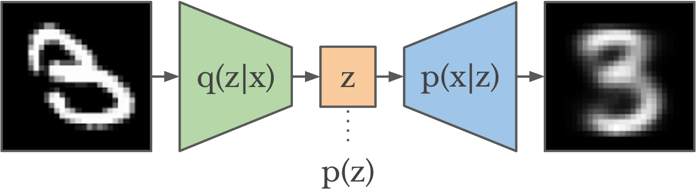

title: Variational Encoder
date: 2025-05-31
author: emisshula
category: Probability
tags: ambition, 
slug: vae

I am interested in making a contribution to Emedded Optimal Transport
by extending some of the low dimensional encoding techniques to
Optimal Transport.  This is the first of my projects to learn the
computational literature and techniques

You can visit my code:
([https://github.com/EvanMisshula/variational-encoder](https://github.com/EvanMisshula/variational-encoder))

## 🧠 What Is a Variational Autoencoder?

A **Variational Autoencoder (VAE)** is a type of **generative model**. It learns to represent data (like images, text, etc.) using a smaller number of **latent variables**, and it can also generate new data that looks like the training data.

It's based on two main ideas:

1.  **Autoencoders** – Learn to compress and then reconstruct data.
2.  **Variational inference** – Approximate complex probability
    distributions using simpler ones.

## 🔧 Architecture of a VAE

A VAE consists of two neural networks:

<table border="2" cellspacing="0" cellpadding="6" rules="groups" frame="hsides">

<colgroup>
<col  class="org-left" />

<col  class="org-left" />

<col  class="org-left" />
</colgroup>
<tbody>
<tr>
<td class="org-left">Component</td>
<td class="org-left">Name</td>
<td class="org-left">Description</td>
</tr>

<tr>
<td class="org-left">---------</td>
<td class="org-left">----------------------------</td>
<td class="org-left">------------------------------------------------------------------------------------</td>
</tr>

<tr>
<td class="org-left">Encoder</td>
<td class="org-left">\( q\_{\phi(z   \vert x)} \)</td>
<td class="org-left">Takes data \(x\) and produces a distribution over latent variables \(z\).</td>
</tr>

<tr>
<td class="org-left">Decoder</td>
<td class="org-left">\( p\_{\theta(x \vert z)} \)</td>
<td class="org-left">Takes a sample \(z\)and tries to reconstruct the original data \(x\).</td>
</tr>
</tbody>
</table>

Instead of mapping $x \rightarrow z \rightarrow x$ directly, the VAE treats $z$ as **random** and uses **probability distributions**.

## 🎯 Goal of the VAE

Learn two things:

1.  How to **compress** data into a meaningful latent representation $z$.
2.  How to **generate** new data from latent variables.

We want to learn the **joint probability**:

\begin{equation}
p_\theta(x, z) = p_\theta(x|z)p(z)
\end{equation}

and its **marginal**:

\begin{equation}
p_\theta(x) = \int p_\theta(x|z) p(z) \, dz
\end{equation}

But this integral is hard, so we use a trick.

## The Variational Inference Trick

We approximate the true posterior $p(z|x)$ using a simpler
distribution $q_\phi(z|x)$. Then we optimize the **Evidence Lower Bound
(ELBO)**:

\begin{equation}
\log p_\theta(x) \geq \mathbb{E}_{q_\phi(z|x)}[\log p_\theta(x|z)] - \mathrm{KL}(q_\phi(z|x) \Vert p(z))
\end{equation}

### Breakdown of ELBO:

-   $\mathbb{E}_{q_\phi(z|x)}[\log p_\theta(x|z)]$ = reconstruction
    accuracy.
-   $\mathrm{KL}(\cdot)$ = how close our approximation $q$ is to the
    prior $p(z)$ (usually a standard normal).

## Training Procedure

1.  Given input $x$, encode it to parameters $\mu(x), \sigma(x)$
    for a Gaussian distribution.
2.  Sample $z \sim \mathcal{N}(\mu(x), \sigma^2(x))$ using the
    **reparameterization trick**:

\begin{equation}
z = \mu + \sigma \odot \epsilon, \quad \epsilon \sim \mathcal{N}(0, I)
\end{equation}

1.  Decode $z \rightarrow x'$ and compare to original $x$.
2.  Optimize the **ELBO** using gradient descent.

## Why Use VAEs?

1.  **Uncertainty-aware**: Learns distributions, not just points.
2.  **Generative**: Can sample new data points by sampling $z \sim
       \mathcal{N}(0, I)$.
3.  **Smooth latent space**: Small changes in $z$ lead to smooth
    changes in generated $x$.
4.  **Principled framework**: Based on variational inference and
    probability.

## Example: MNIST Digits

# The encoder maps digit images (28×28 pixels) to a 2D latent space.

# The decoder learns to reconstruct digits from 2D points.

# You can sample from this 2D space to generate new digit images!

## Summary

<table border="2" cellspacing="0" cellpadding="6" rules="groups" frame="hsides">

<colgroup>
<col  class="org-left" />

<col  class="org-left" />

<col  class="org-left" />
</colgroup>
<tbody>
<tr>
<td class="org-left">Concept</td>
<td class="org-left">Object</td>
<td class="org-left">Description</td>
</tr>

<tr>
<td class="org-left">---------------------</td>
<td class="org-left">-----------------------------</td>
<td class="org-left">---------------------------------------------------------------</td>
</tr>

<tr>
<td class="org-left">Latent Variable</td>
<td class="org-left">\(z\)</td>
<td class="org-left">Hidden representation of the data</td>
</tr>

<tr>
<td class="org-left">Encoder</td>
<td class="org-left">\( q\_{\phi(z \vert   x)} \)</td>
<td class="org-left">Neural network that learns \(z\) from \(x\)</td>
</tr>

<tr>
<td class="org-left">Decoder</td>
<td class="org-left">\( p\_{\theta(x \vert z)} \)</td>
<td class="org-left">Reconstructs or generates \(x\) from \(z\)</td>
</tr>

<tr>
<td class="org-left">ELBO</td>
<td class="org-left">&#xa0;</td>
<td class="org-left">A loss function that balances reconstruction and regularization</td>
</tr>

<tr>
<td class="org-left">Reparameterization</td>
<td class="org-left">&#xa0;</td>
<td class="org-left">Trick to make sampling differentiable for backpropagation</td>
</tr>
</tbody>
</table>

