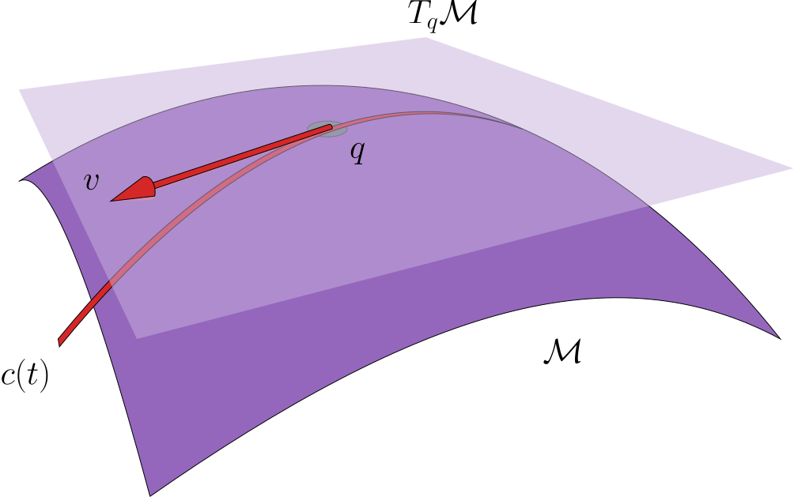

title: Ambition
modified: 2025-05-26
tags: ambition, activities
slug: ambition
label: ambition
authors: Evan Misshula
summary: Evan's Ambition

# Math Goal

By the end of the summer I want to have read all of the following
papers and have an outline of my own original contribution.

# Foundational & General Approaches

1.  **[A Riemannian Framework for Optimal Transport](<https://arxiv.org/abs/1805.08372>)**
    -   Authors: M. Arjovsky, A. Doucet, et al.
    -   Develops a geometry-aware framework for OT over manifolds, making
        PCA-like generalizations more natural in curved spaces.

2.  **[Learning Generative Models with Sinkhorn Divergences](<https://arxiv.org/abs/1903.08508>)**
    -   Authors: Genevay et al.
    -   While not PCA-specific, this introduces latent representations
        learned with OT-based losses—relevant for embedding/latent space
        OT.

# PCA-Like and Subspace Methods with OT

1.  **[Wasserstein Principal Geodesic Analysis](<https://arxiv.org/abs/1806.00271>)**
    -   Authors: Seguy, Cuturi
    -   Generalizes PCA to the Wasserstein space using geodesic analysis,
        important for structured data like distributions.

2.  **[Wasserstein Principal Component Analysis: Sparse Optimal Transport Based Dimensionality Reduction](<https://arxiv.org/abs/2012.08877>)**
    -   Authors: Wang et al.
    -   An explicit method for **Wasserstein PCA**, adapted for probability distributions rather than Euclidean vectors.

3.  **[A New Formulation of Principal Geodesic Analysis in the Wasserstein Space](<https://arxiv.org/abs/2107.05353>)**
    -   Authors: Bigot et al.
    -   Focuses on computing principal components in Wasserstein space
        more efficiently, relevant for shape and distributional data.

# Embedded Manifolds & Latent OT

1.  **[Learning Optimal Transport Maps using Generative Adversarial Networks](<https://arxiv.org/abs/1709.05011>)**
    -   Introduces learning OT in **latent/embedded spaces**, allowing
        for manifold-constrained transport.

2.  **[Learning Optimal Transport for Domain Adaptation](<https://arxiv.org/abs/1705.08848>)**
    -   Authors: Damodaran et al.
    -   Uses **PCA for latent dimensionality reduction**, then applies OT—an instance of **embedded OT**.

3.  **[Manifold Matching using OT](<https://arxiv.org/abs/1707.08272>)**
    -   Proposes OT over **non-Euclidean geometries** (e.g., spheres), and
        matching distributions on these curved spaces.

# Autoencoders, Latent Space + OT

1.  **[Sliced-Wasserstein Autoencoders](<https://arxiv.org/abs/1804.01947>)**
    -   Uses Sliced-Wasserstein distance in a **latent representation learning** setting.

2.  **[Autoencoding Probabilistic PCA with Optimal Transport](<https://arxiv.org/abs/2104.03386>)**
    -   Combines PCA, probabilistic models, and OT regularization.

# Other Notable Contributions

1.  **[Wasserstein Dictionary Learning](<https://arxiv.org/abs/1801.01445>)**
    -   Extends PCA to the OT setting via sparse dictionary learning over probability distributions.

2.  **[Sliced-Wasserstein Flow: Nonparametric Generative Modeling via Optimal Transport and Diffusions](<https://arxiv.org/abs/2006.02791>)**
    -   Uses diffusion + OT to generate data in embedded spaces, related to low-dimensional transport learning.

# Summary of Concepts

<table border="2" cellspacing="0" cellpadding="6" rules="groups" frame="hsides">

<colgroup>
<col  class="org-left" />

<col  class="org-left" />
</colgroup>
<tbody>
<tr>
<td class="org-left">Concept</td>
<td class="org-left">Relation to OT</td>
</tr>

<tr>
<td class="org-left">-------------------------</td>
<td class="org-left">-----------------------------------------</td>
</tr>

<tr>
<td class="org-left"><b>Wasserstein PCA</b></td>
<td class="org-left">PCA in probability/measure space</td>
</tr>

<tr>
<td class="org-left"><b>Geodesic PCA (PGA)</b></td>
<td class="org-left">PCA generalized to curved OT geometry</td>
</tr>

<tr>
<td class="org-left"><b>Latent OT / Embedded OT</b></td>
<td class="org-left">OT after PCA or in learned subspaces</td>
</tr>

<tr>
<td class="org-left"><b>Sliced Wasserstein</b></td>
<td class="org-left">Efficient approximation of OT for high-D</td>
</tr>

<tr>
<td class="org-left"><b>Manifold OT</b></td>
<td class="org-left">Optimal transport on Riemannian manifolds</td>
</tr>

<tr>
<td class="org-left"><b>Autoencoding + OT</b></td>
<td class="org-left">Embedding generation with OT-based loss</td>
</tr>
</tbody>
</table>

