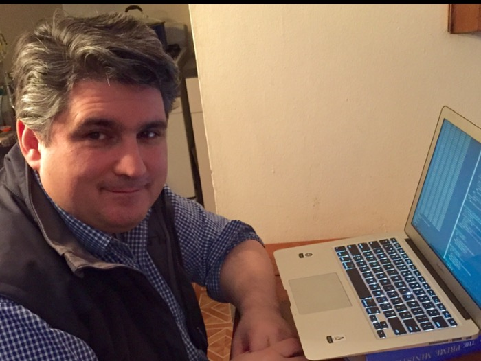

title: Bio
modified: 2014-03-10
tags: bio, activities
slug: bio
label: bio
authors: Evan Misshula
summary: Intro to Evan

# Academic 

I graduated from Columbia University with a degree in the Mathematics
of Finance where I was the assistant organizer for the  ([Optimal Trasnport
Reading Group](https://evanmisshula.github.io/log-concave-sampling")). I 
was offered a spot in the MA in Statistics program but I am going to 
take some more courses and re-apply for the PhD Mathematical Statistics.  

I was formerly a PhD student in [Criminal
Justice](http://gc.cuny.edu/Page-Elements/Academics-Research-Centers-Initiatives/Doctoral-Programs/Criminal-Justice)
at the [CUNY Graduate Center](http://gc.cuny.edu/Home). I have
previously won fellowships from the CUNY Graduate Center, the
University of Chicago and the University of Illinois at
Urbana-Champaigne.

# Advocacy and charitable work

Through [Columbia University's Center for
Justice](http://centerforjustice.columbia.edu/) I previously taught
Python to detainees on Rikers Island.  I also mentor for the [College
Initiative](http://www.collegeinitiative.org/ci2/), a project which
helps people returning from prison access higher education.  I am a
member of (and have given at least one preentation at) the meetup
groups [NYC-D3-JS](http://www.meetup.com/NYC-D3-JS/), [NYC
Python](http://www.meetup.com/nycpython/) and
[Emacsnyc.](http://emacsnyc.org/)

# Resume

Here is a link to my resume. ([EM](../images/EM.pdf)). 

# Research Interests

I am interested in probability and decision making.  The specific
problem I am working on is combining subspace methods like PCA with 
optimal transport to compute large scale machine learning problems
in reasonable time.

# Publications

Here is a link to my google [scholar](http://scholar.google.com/citations?hl%3Den&user%3Df8E8wB0AAAAJ) page. 

# Social media

-   Email: EMisshula(at)jjay(dot)cuny(dot)edu
-   Twitter: @EMisshula
-   facebook: <http://www.facebook.com/evan.misshula>
-   Github: <http://github.com/EvanMisshula>
-   LinkedIn: <http://www.linkedin.com/pub/evan-misshula/>
